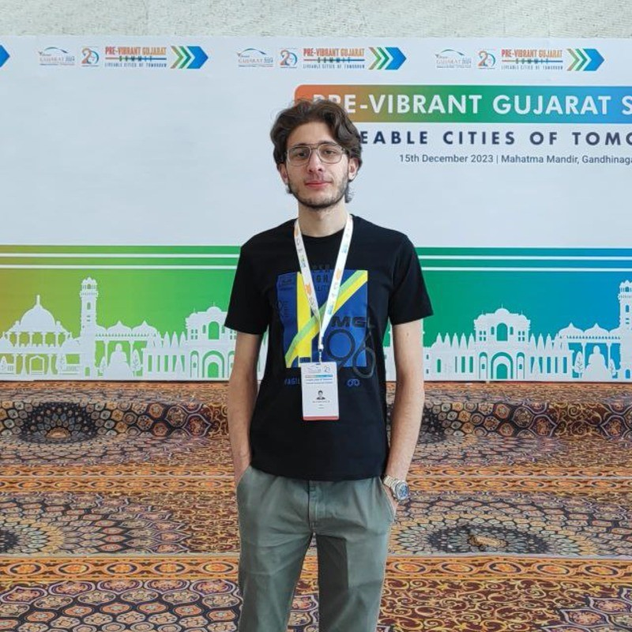

<!DOCTYPE html>
<html lang="en" style="scroll-behavior: smooth;">
<head>
  <meta charset="UTF-8">
  <meta name="viewport" content="width=device-width, initial-scale=1.0">
  <title>Tarek Rajab | Developer & Data Enthusiast</title>
  <meta name="description" content="Portfolio of Tarek Rajab - From Biomedical Science to Full Stack Engineering and Data Science.">
  <link rel="preconnect" href="https://fonts.googleapis.com">
  <link rel="preconnect" href="https://fonts.gstatic.com" crossorigin>
  <link href="https://fonts.googleapis.com/css2?family=Inter:wght@400;500;600;700;800&display=swap" rel="stylesheet">
  
</head>
<body>
  <header class="nav-shell">
    

      <nav class="nav">
        <a href="#home" class="nav-brand">Tarek Rajab</a>
        

          <a href="#home">Home</a>
          <a href="#intro">Introduction</a>
          <a href="#projects">Projects</a>
          <a href="#skills">Skills</a>
          <a href="#future">Future</a>
          <a href="#ethics">Ethics</a>
          <a href="#conclusion">Conclusion</a>
          <a href="#resume" class="nav-cta">Resume</a>
        

        <button id="navToggle" class="nav-toggle" aria-label="Toggle navigation">
          <svg id="iconMenu" xmlns="http://www.w3.org/2000/svg" viewBox="0 0 24 24" fill="none">
            <path d="M4 7h16M4 12h16M4 17h10" stroke="currentColor" stroke-width="1.7" stroke-linecap="round"/>
          </svg>
          <svg id="iconClose" xmlns="http://www.w3.org/2000/svg" viewBox="0 0 24 24" fill="none" style="display:none">
            <path d="M6 6l12 12M18 6l-12 12" stroke="currentColor" stroke-width="1.7" stroke-linecap="round"/>
          </svg>
        </button>
      </nav>
    

    

      <a href="#home">Home</a>
      <a href="#intro">Introduction</a>
      <a href="#projects">Projects</a>
      <a href="#skills">Skills</a>
      <a href="#future">Future</a>
      <a href="#ethics">Ethics</a>
      <a href="#conclusion">Conclusion</a>
      <a href="#resume" class="nav-mobile-cta">View Resume</a>
    

  </header>

  <main>
    <section id="home" class="section">
      

        

          

            
            Open to internships · Backend & Data
          

          <h1 class="headline">
            From biomedical science
            to full-stack engineering & data
          </h1>
          

            I’m a Computer Science student (class of 2027) who transitioned from Biomedical Engineering.
            I build robust backend systems with Java & Spring, and I’m steadily moving toward a future in
            Data Science and AI.
          

          

            <a href="mailto:eliosrajab@gmail.com" class="btn btn-primary">Contact me</a>
            <a href="#projects" class="btn btn-ghost">See my work</a>
          

          

            <strong>Backend:</strong> Java, Spring Boot, REST APIs
            <strong>Data:</strong> Python, Pandas, ML basics
            <strong>Domain:</strong> Healthcare, clinical data
          

        

        

          

            

            

            

              
            

          

        

      

    </section>

    <section id="intro" class="section">
      

        

          

            
Introduction

            <h2 class="section-title">Learning philosophy</h2>
            

              My path from Biomedical Engineering to Computer Science was driven by curiosity about how systems work,
              both biological and digital. That shift clarified what motivates me: solving real problems with logic,
              data, and code.
            

            

              

                
Core pillars

                

                  I learn best by building, breaking, and fixing. I value:
                  curiosity about how and why things work,
                  persistence when they don’t, and
                  practical application that turns theory into something tangible.
                

              

              

                
How I approach new tech

                

                  When I explore a new concept, I usually move from documentation to small experiments, then to a
                  project that forces me to combine multiple ideas. This helps me build a mental model that is
                  deeper than just syntax or surface-level patterns.
                

              

            

          

          

            

              
Collaboration & empathy

              <h3 class="section-title" style="font-size:1.2rem;margin-top:.3rem">Experience in patient-centered work</h3>
              

                During my internship at a physiotherapy centre, I acted as the link between staff and patients.
                I assisted clients, managed patient flow, and supported a smooth rehabilitation process.
              

              

                This strengthened my communication, organisational, and interpersonal skills in a real-world,
                high-pressure environment. Today, I bring the same empathy and clarity when collaborating with
                teammates, stakeholders, or non-technical audiences.
              

              

                Patient-facing experience
                Stakeholder communication
                High-pressure environments
              

            

          

        

      

    </section>

    <section id="projects" class="section">
      

        

          

            
            Featured work
          

          <h2 class="headline" style="font-size:2rem;margin-top:1rem">Interdisciplinary projects</h2>
          

            I enjoy building systems where reliability and clarity matter. Below is a full-stack hospital
            application that brings together my interest in healthcare and backend engineering.
          

        

        

          

            
Full-stack project

            <h3 class="project-title">Hospital management web application</h3>
            

              A web platform that combines a public-facing hospital website with a secure backend application for managing
              patients, appointments, and doctors.
            

            

              <strong>Backend:</strong> Java · Spring Boot · Spring Security
              <strong>Frontend:</strong> HTML · CSS · JavaScript
              <strong>Focus:</strong> Robust APIs · Clean domain model
            

            

              

                
                
Designed and implemented REST APIs to manage patients, appointments, and doctor schedules with proper validation.

              

              

                
                
Integrated Spring Security and role-based access control to protect sensitive medical and scheduling data.

              

              

                
                
Built a responsive public website so patients can explore services, doctors, and contact information easily.

              

            

            

              <a href="https://github.com/TarekRajab0" target="_blank" class="btn btn-ghost" style="padding:.6rem 1.2rem;font-size:.9rem">
                View repository
              </a>
            

          

          

            

              

                

                  
                  
                  
                

                PatientController.java
              

              <pre class="code-body"><code>@RestController
@RequestMapping("/api/patients")
public class PatientController {

    @Autowired
    PatientService patientService;

    @GetMapping("/{id}")
    ResponseEntity&lt;Patient&gt;
    getPatientById(@PathVariable Long id) {
        Patient patient =
            patientService.findPatientById(id);

        return
            ResponseEntity.ok(patient);
    }

    @PostMapping
    ResponseEntity&lt;Patient&gt;
    createPatient(
        @RequestBody Patient patient
    ) {
        Patient saved =
            patientService.savePatient(patient);

        return new ResponseEntity&lt;&gt;(
            saved,
            HttpStatus.CREATED
        );
    }
}</code></pre>
            

          

        

      

    </section>

    <section id="skills" class="section">
      

        
Core competencies

        <h2 class="section-title">What I’m actively strengthening</h2>
        

          I’m building depth in backend engineering while developing strong foundations in data science and
          communication skills that translate across domains.
        

        

          

            
Engineering

            <h3 class="skill-title">Backend with Java & Spring</h3>
            

              Ability to design and build secure, maintainable, and scalable backend services with Spring Boot,
              RESTful APIs, and clean separation between layers.
            

            

              Artefact: Hospital management application source code.
            

          

          

            
Computer science

            <h3 class="skill-title">Problem solving & data structures</h3>
            

              Strong grasp of core CS fundamentals, using data structures and algorithms to write efficient,
              predictable code rather than relying on trial and error.
            

            

              Artefact: DSA coursework and problem-solving certifications.
            

          

          

            
Human skills

            <h3 class="skill-title">Communication & collaboration</h3>
            

              Experience explaining complex ideas to people from non-technical backgrounds and collaborating with
              diverse teams under time pressure.
            

            

              Artefact: Internship evaluation from physiotherapy centre.
            

          

        

      

    </section>

    <section id="future" class="section">
      

        

          

            
Future horizon

            <h2 class="section-title">Path toward data science</h2>
            

              My long-term goal is to become a data scientist who can move from raw information to clear,
              actionable insights, especially in healthcare and high-impact domains.
            

            

              

                
Current focus

                

                  I am strengthening my Python fundamentals and working through data science tools such as
                  Pandas, NumPy, scikit-learn, and introductory deep learning libraries.
                

              

              

                
How I like to work with data

                

                  I enjoy the process from data cleaning to feature selection, building simple baseline models,
                  and then iterating thoughtfully instead of jumping straight to complex solutions.
                

              

            

          

          

            

              
Featured data project

              <h3 class="section-title" style="font-size:1.2rem;margin-top:.3rem">
                Leukemia clinical data analysis (research paper contribution)
              </h3>
              

                Contributed to a research conference paper by analysing clinical trial data to identify patterns
                and possible markers of treatment efficacy for leukemia patients.
              

              

                Python · Pandas
                Exploratory data analysis
                Matplotlib · Seaborn
              

              

                

                  

                    

                      

                    

                    

                  

                  

                    
Data preparation

                    
Cleaning and structuring datasets

                    

                      Used Python and Pandas to clean raw clinical data, handle missing values, and construct
                      consistent features for downstream analysis.
                    

                  

                

                

                  

                    

                      

                    

                    

                  

                  

                    
Insight

                    
Visualising trends and responses

                    

                      Visualised patient responses over time using Matplotlib and Seaborn, helping the team
                      quickly spot emerging patterns and potential efficacy markers.
                    

                    

                      Data used responsibly with anonymisation in mind.
                    

                  

                

              

              

                <a href="https://github.com/TarekRajab0" target="_blank" class="btn btn-ghost" style="padding:.55rem 1.1rem;font-size:.85rem">
                  View data-related work
                </a>
              

            

          

        

      

    </section>

    <section id="ethics" class="section">
      

        
Ethics & global awareness

        <h2 class="section-title">Building systems that should exist</h2>
        

          My interest in healthcare software naturally exposed me to one of the most sensitive types of data:
          patient information. That experience shaped how I think about security, privacy, and impact.
        

        

          

            <h3 class="ethics-card-title">Healthcare data case study</h3>
            

              When handling patient records, the impact of a single mistake is not theoretical. A small bug,
              misconfigured endpoint, or weak access rule can expose deeply sensitive information and break
              patient trust.
            

            

              

                
                

                  Recognising that security is not an optional feature but a basic requirement for any system
                  working with real people and real consequences.
                

              

              

                
                

                  Being careful with logging, error messages, and data access patterns so that sensitive details
                  aren’t leaked unnecessarily.
                

              

            

          

          

            <h3 class="ethics-card-title">Personal principles</h3>
            

              Working with healthcare data made me more aware of how technology can both help and harm. A
              well-designed system can support better decisions and outcomes. A careless one can amplify
              inequality or cause real damage.
            

            

              

                
                

                  I treat user data with the assumption that someone I care about could be directly affected by
                  how it is handled.
                

              

              

                
                

                  I aim to work on projects where I can stand behind both the technical quality and the impact
                  they have on people’s lives.
                

              

            

          

        

      

    </section>

    <section id="conclusion" class="section">
      

        

          

            
Summary

            <h2 class="section-title">Where I am right now</h2>
            

              I am a Computer Science student with a background in biomedical studies, building a foundation in
              backend development and growing steadily into data science and AI.
            

            

              

                
What I bring

                

                  A mix of healthcare context, solid backend fundamentals, and a strong interest in data-driven
                  decision-making. I care about robustness, clarity, and the human impact behind the systems I
                  help build.
                

              

              

                
What I’m looking for

                

                  Opportunities to work on backend or data-oriented projects where I can learn from experienced
                  engineers, contribute meaningfully, and continue merging my technical skills with real-world
                  domains like healthcare.
                

              

            

          

          

            

              
Resume

              <h3 class="section-title" style="font-size:1.15rem;margin-top:.3rem">Want the full story?</h3>
              

                You can view or download my resume for a concise overview of my education, projects, and experience.
              

              

                CS student · Class of 2027
                Backend · Java & Spring
                Data science in progress
              

              

                <a href="resume.pdf" class="btn btn-primary" style="padding:.6rem 1.3rem;font-size:.9rem" target="_blank">
                  Open resume
                </a>
                <a href="mailto:eliosrajab@gmail.com" class="btn btn-ghost" style="padding:.6rem 1.3rem;font-size:.9rem">
                  Request updated copy
                </a>
              

            

          

        

      

    </section>
  </main>

  <footer class="footer-shell">
    

      

        

          <h2 class="footer-title">Let’s build something useful</h2>
          

            I’m happy to discuss internships, junior roles, or collaborations where backend reliability
            and data thinking matter.
          

          

            <a href="mailto:eliosrajab@gmail.com" class="btn btn-primary" style="padding:.65rem 1.4rem;font-size:.9rem">
              Email me
            </a>
            <a href="https://github.com/TarekRajab0" target="_blank" class="btn btn-ghost" style="padding:.65rem 1.4rem;font-size:.9rem">
              GitHub profile
            </a>
          

        

        

          

            <a href="https://www.linkedin.com/in/tarek-rajab" target="_blank" class="social-link">
              
              LinkedIn
            </a>
            <a href="https://github.com/TarekRajab0" target="_blank" class="social-link">
              
              GitHub
            </a>
          

          

            ©  Tarek Rajab
            Built with HTML, CSS and a bit of JS
          

        

      

    

  </footer>

  
</body>
</html>
